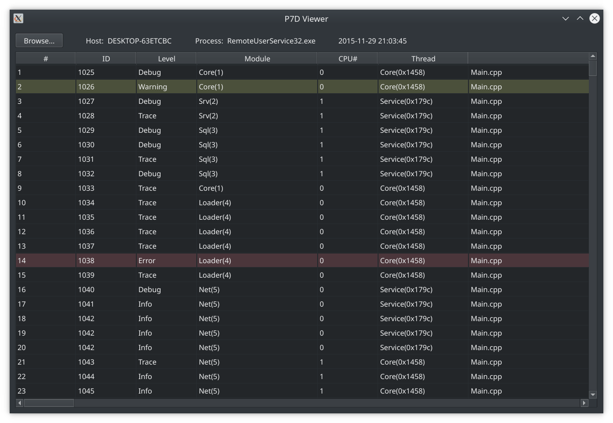

# P7DViewer

A very simple viewer of *.p7d (P7 Dump) files made by open source [P7](http://baical.net/p7.html) logger library.

[Browser (WASM) Version](https://ragnar-lodbrok.github.io/p7dviewer/wasm_build/p7dviewer.html) 

## Limitations

1. Linux only at the moment.
2. Only single stream.
3. Only Trace streams (no telemetry).
4. Very limited (and dirty) as made for personal usage.

## License

This project is licensed under the LGPL 3 License.

Based on code by Baical 2012-2020 (c).

